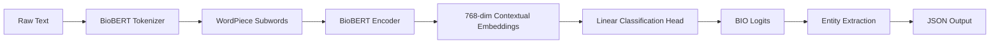

# Biomedical NER with BioBERT

[](https://www.python.org/)
[](https://pytorch.org/)
[](https://huggingface.co/)
[](https://github.com/Helios337/biomed-ner-biobert/actions)
[](LICENSE)

Extract disease entities from biomedical literature using **BioBERT** with strict entity-level evaluation. Features a TF-IDF + Logistic Regression baseline for comparison, comprehensive Error Level Analysis, and a production-ready inference pipeline.

---

## Results

| Model | Token-Level F1 | Entity-Level (Strict) F1 |
|---|---|---|
| TF-IDF + Logistic Regression (baseline) | ~65.2% | **41.5%** |
| BioBERT (dmis-lab/v1.1) | ~93.8% | **87.2%** |

The massive gap between token and entity F1 demonstrates why sequence-labeling models must be evaluated on exact span matches, not per-token accuracy.

## Quick Start

```bash
# Clone and install
git clone https://github.com/Helios337/biomed-ner-biobert.git
cd biomed-ner-biobert
python3 -m venv venv && source venv/bin/activate
pip install -e ".[dev]"

# Train (5 epochs on NCBI Disease)
python scripts/train.py --config configs/base_config.yaml

# Run inference
python -c "from src.inference import BioNERPipeline; p = BioNERPipeline(); print(p.predict('Patient with colorectal cancer and type 2 diabetes'))"
```

## Project Structure

```
biomed-ner-biobert/
├── src/                         # Core library
│   ├── __init__.py              # Public API exports
│   ├── data_loader.py           # NCBI Disease dataset loader + BIO validation
│   ├── dataset.py               # PyTorch Dataset wrapper
│   ├── tokenizer_utils.py       # BioBERT tokenizer + label alignment
│   ├── model_factory.py         # Model creation with config
│   ├── trainer.py               # Training loop with early stopping
│   ├── evaluator.py             # Token-level + entity-level metrics + viz
│   ├── inference.py             # Production inference pipeline
│   ├── error_analysis.py        # Structured error categorization
│   └── baseline_model.py        # TF-IDF + Logistic Regression baseline
├── scripts/
│   ├── train.py                 # Training entry point
│   ├── preprocess_data.py       # Data download script
│   └── run_train.sh             # Shell wrapper for training
├── configs/
│   └── base_config.yaml         # Default hyperparameters
├── tests/
│   └── test_alignment.py        # Label alignment unit tests
├── .github/workflows/ci.yml     # CI pipeline
├── Dockerfile                   # Container build
├── pyproject.toml               # Project metadata & build config
├── Makefile                     # Common commands
└── requirements.txt             # Dependency tracking
```

## Architecture



### Label Alignment Strategy

WordPiece tokenization splits rare biomedical terms (e.g., `neurofibromatosis` → `["neuro", "##fib", "##roma", "##tosis"]`). To avoid inflating loss on subwords, only the *first* subword token receives the true BIO label. Subsequent subwords and special tokens (`[CLS]`, `[SEP]`) are masked with `-100`.

### Evaluation

- **Token-level** (per-tag accuracy) — misleading because the dominant "O" class inflates scores
- **Entity-level** (strict span match via `seqeval`) — a prediction is correct only if both boundaries AND entity type match exactly

## Error Analysis

| Category | % of Errors | Description |
|---|---|---|
| Boundary Errors | ~40% | Model finds entity but truncates modifiers |
| Rare Entity Errors | ~25% | False negatives on obscure/zero-shot terms |
| Long Sentence Errors | ~20% | Attention degrades beyond 50 tokens |
| Spurious Entities | ~15% | Hallucinated disease from symptom text |

## Future Work

- CRF layer on top of BERT to enforce valid BIO transitions
- UMLS data augmentation for rare entity robustness
- Sliding window inference for long documents (>512 tokens)

## License

MIT